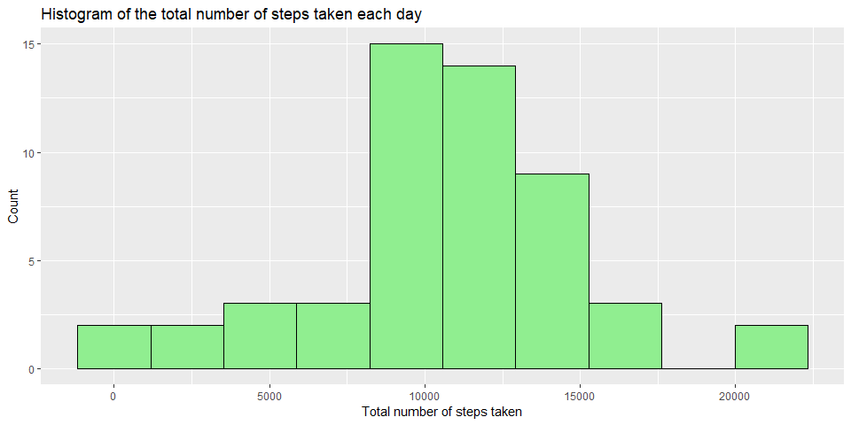
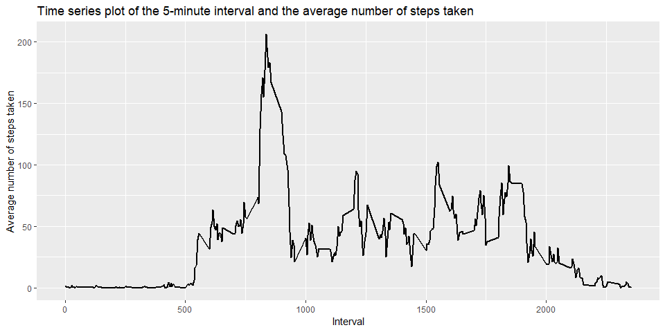
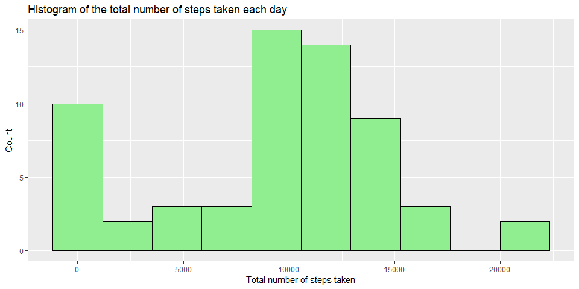
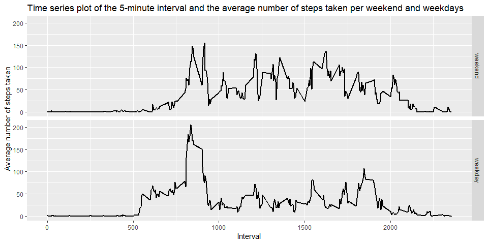

## Introduction

It is now possible to collect a large amount of data about personal movement using activity monitoring devices such as a Fitbit, Nike Fuelband, or Jawbone Up. These type of devices are part of the "quantified self" movement - a group of enthusiasts who take measurements about themselves regularly to improve their health, to find patterns in their behavior, or because they are tech geeks. But these data remain under-utilized both because the raw data are hard to obtain and there is a lack of statistical methods and software for processing and interpreting the data.

This assignment makes use of data from a personal activity monitoring device. This device collects data at 5 minute intervals through out the day. The data consists of two months of data from an anonymous individual collected during the months of October and November, 2012 and include the number of steps taken in 5 minute intervals each day.

#### Data

The data for this assignment can be downloaded from the course web site:

Dataset: [Activity monitoring data](https://d396qusza40orc.cloudfront.net/repdata%2Fdata%2Factivity.zip)

The variables included in this dataset are:

- steps: Number of steps taking in a 5-minute interval (missing values are coded as NA)
- date: The date on which the measurement was taken in YYYY-MM-DD format
- interval: Identifier for the 5-minute interval in which measurement was taken

The dataset is stored in a comma-separated-value (CSV) file and there are a total of 17568 observations in this dataset.


## The analysis

### 1. Loading and preprocessing the data

#### a) Load the data (i.e. read.csv())

In this part of the analysis the data is downloaded and loaded in RMarkDown code, to ensure maximum reproducibility of the assignment.


```r
required_packages <- c("tidyverse", "knitr", "timeDate")
packages_to_install <- required_packages[!(required_packages %in% installed.packages()[,"Package"])]
if(length(packages_to_install)) install.packages(packages_to_install)
lapply(required_packages, require, character.only = TRUE)

if(!file.exists("./data")) {
  dir.create("./data")
  url <- "https://d396qusza40orc.cloudfront.net/repdata%2Fdata%2Factivity.zip"
  download.file(url, "./data/data.zip")
  unzip("./data/data.zip",exdir="./data")
}

data <- read.table("./data/activity.csv", sep=",", header=TRUE)
```

#### b) Process/transform the data (if necessary) into a format suitable for your analysis

We didn't do any preprocessing of the data, but instead we did simple exploratory analysis to check the data. We have seen that the data is correctly formated and the raw provided data is in tidy format.


```r
head(data)
```

```
  steps       date interval
1    NA 2012-10-01        0
2    NA 2012-10-01        5
3    NA 2012-10-01       10
4    NA 2012-10-01       15
5    NA 2012-10-01       20
6    NA 2012-10-01       25
```

```r
tail(data)
```

```
      steps       date interval
17563    NA 2012-11-30     2330
17564    NA 2012-11-30     2335
17565    NA 2012-11-30     2340
17566    NA 2012-11-30     2345
17567    NA 2012-11-30     2350
17568    NA 2012-11-30     2355
```

```r
dim(data)
```

```
[1] 17568     3
```

```r
str(data)
```

```
'data.frame':	17568 obs. of  3 variables:
 $ steps   : int  NA NA NA NA NA NA NA NA NA NA ...
 $ date    : Factor w/ 61 levels "2012-10-01","2012-10-02",..: 1 1 1 1 1 1 1 1 1 1 ...
 $ interval: int  0 5 10 15 20 25 30 35 40 45 ...
```


### 2. What is mean total number of steps taken per day?

For this part of the assignment, you can ignore the missing values in the dataset.

#### a) Calculate the total number of steps taken per day

Using `dplyr` we summarized the data. We did not remove NA values since this way those data remains NA and won't show on plot.


```r
total_day <- data %>%
  group_by(date) %>%
  summarize(sum=sum(steps))
```

#### b) If you do not understand the difference between a histogram and a barplot, research the difference between them. Make a histogram of the total number of steps taken each day

We ploted the histogram using ggplot. We can see the warining indicating that some of the days have all data missing and that the histogram has it's peak value around 10000 total steps a day. We know the difference between histogram and barplot!


```r
ggplot(total_day, aes(sum)) +
  geom_histogram(bins = 10, fill="lightgreen", color="black") +
  labs(x="Total number of steps taken", y="Count", title="Histogram of the total number of steps taken each day")
```

```
## Warning: Removed 8 rows containing non-finite values (stat_bin).
```

<!-- -->

#### c) Calculate and report the mean and median total number of steps taken per day

The mean total number of steps taken per day is 10766.19, while the median is 10765.


```r
mean_day <- mean(total_day$sum, na.rm = TRUE)
median_day <- median(total_day$sum, na.rm = TRUE)
q1p2_df <- data.frame(mean=mean_day, median=median_day)
kable(q1p2_df)
```

     mean   median
---------  -------
 10766.19    10765


### 3. What is the average daily activity pattern?

#### a) Make a time series plot (i.e. type = "l") of the 5-minute interval (x-axis) and the average number of steps taken, averaged across all days (y-axis)

We can see on the plot that acivity is very low at the left and right parts of the plot. Those are night times and it is expected that activity is low at that time. The highest acivity is in the morning, around 8 or 9 AM.


```r
mean_interval <- data %>%
  group_by(interval) %>%
  summarize(mean=mean(steps, na.rm = TRUE))
ggplot(mean_interval, aes(x=interval, y=mean)) +
  geom_line(size=1) +
  labs(x="Interval", y="Average number of steps taken", title="Time series plot of the 5-minute interval and the average number of steps taken")
```

<!-- -->

#### b) Which 5-minute interval, on average across all the days in the dataset, contains the maximum number of steps?

Since the maximum acivity (number of steps) is at 8:35 AM, this corresponds with the information we gained from the previous plot. So the highest activity is in the morning, around 8:35 AM.


```r
message("Interval with maximum number of steps is ", filter(mean_interval,mean==max(mean))[1], 
        " and it contains average ", round(filter(mean_interval,mean==max(mean))[2],2), " steps")
```

```
## Interval with maximum number of steps is 835 and it contains average 206.17 steps
```


### 4. Imputing missing values

Note that there are a number of days/intervals where there are missing values (coded as NA). The presence of missing days may introduce bias into some calculations or summaries of the data.

#### a) Calculate and report the total number of missing values in the dataset (i.e. the total number of rows with NAs)

We have already gotten warning that 8 days have all values missing. Now we can see that overall there are 2304 missing values in our data. This corresponds to about 13% of the data.


```r
num_NAs <- sum(is.na(data$steps))
message("The number of NA values is:  ", num_NAs)
```

```
## The number of NA values is:  2304
```

#### b) Devise a strategy for filling in all of the missing values in the dataset. The strategy does not need to be sophisticated. For example, you could use the mean/median for that day, or the mean for that 5-minute interval, etc.

We've decided to impute the missing data with the median value of each interval. We first calculated median of each interval.


```r
median_interval <- data %>%
  group_by(interval) %>%
  summarize(median=median(steps, na.rm = TRUE))
```

#### c) Create a new dataset that is equal to the original dataset but with the missing data filled in.

In the second part of imputation, we created the imputed data by looking for missing values (NAs) and filling them with median for that particular interval. To do that we had to match the intervals. As we can see, we now don't have any missing values (NAs) in the data. 


```r
data_impute <- data
for (i in 1:nrow(data_impute)) {
  if (is.na(data_impute[i,"steps"])) {
    data_impute[i,"steps"] <- median_interval[median_interval$interval==data_impute[i,"interval"], "median"]
  }
}
message("The number of NA values after imputation is:  ", sum(is.na(data_impute$steps)))
```

```
## The number of NA values after imputation is:  0
```

#### d) Make a histogram of the total number of steps taken each day and Calculate and report the mean and median total number of steps taken per day. Do these values differ from the estimates from the first part of the assignment? What is the impact of imputing missing data on the estimates of the total daily number of steps?

The histogram now shows that there are many more low values, around 0. Values of mean and median now and from previous analysis differ and they are significanly lower now. The reason for that is that we imputed the data with medians. Even while ignoring the NAs, calculated medians for each interval are small because there are many 0 values in the data. Because of that, both, the mean and the median of total daily number of steps are lower. Difference in mean is -1262.32, while for the median difference is -370. 


```r
total_day_imp <- data_impute %>%
  group_by(date) %>%
  summarize(sum=sum(steps))
ggplot(total_day_imp, aes(sum)) +
  geom_histogram(bins = 10, fill="lightgreen", color="black") +
  labs(x="Total number of steps taken", y="Count", title="Histogram of the total number of steps taken each day")
```

<!-- -->

```r
mean_day_imp <- mean(total_day_imp$sum, na.rm = TRUE)
median_day_imp <- median(total_day_imp$sum, na.rm = TRUE)
q3p4_df <- data.frame(mean=mean_day_imp, median=median_day_imp)
kable(q3p4_df)
```

     mean   median
---------  -------
 9503.869    10395

```r
kable(q3p4_df-q1p2_df)
```

     mean   median
---------  -------
 -1262.32     -370


### 5. Are there differences in activity patterns between weekdays and weekends?

For this part the weekdays() function may be of some help here. Use the dataset with the filled-in missing values for this part.

#### a) Create a new factor variable in the dataset with two levels -- "weekday" and "weekend" indicating whether a given date is a weekday or weekend day.

We decided to simplify our analysis and used function `isWeekday()` from `timeDate` package insted of `weekdays()`. Using that package and piping from `dplyr`, we've created new factor variable *week*. 


```r
data_new <- data_impute %>%
  mutate(week=factor(isWeekday(date)))
levels(data_new$week) <- c("weekend", "weekday")
```

#### b) Make a panel plot containing a time series plot (i.e. type = "l") of the 5-minute interval (x-axis) and the average number of steps taken, averaged across all weekday days or weekend days (y-axis). The plot should look something like the following, which was created using simulated data:

We've created the needed plot using ggplot. We can see that activity (number of steps) patterns differ between weekends and weekdays. During weekdays activity is higher in the morning, around 8-9 AM, while during the weekends we have higher activity during the rest of the day.


```r
data_new_interval_mean <- data_new %>%
  group_by(interval,week) %>%
  summarize(mean=mean(steps))
ggplot(data_new_interval_mean, aes(x=interval, y=mean)) +
  geom_line(size=1) +
  facet_grid(week~.) +
  labs(x="Interval", y="Average number of steps taken", title="Time series plot of the 5-minute interval and the average number of steps taken per weekend and weekdays")
```

<!-- -->


## Conclusions

During this analysis we've analysed the activity of participants during the day. We have seen some patterns and concluded that people have highest activity during morning hours, specially on weekdays. During weekends people are more active during the day. We have also seen that imputing the data using the median values can sometimes be a bad idea and give biased values, in our case too low. All in all, we have completed the analysis in clean and reproducible manner.

